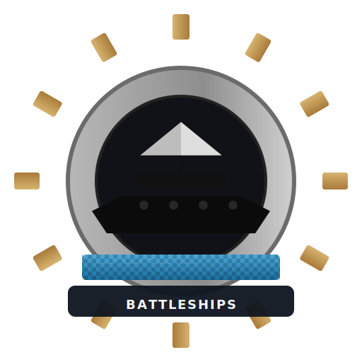
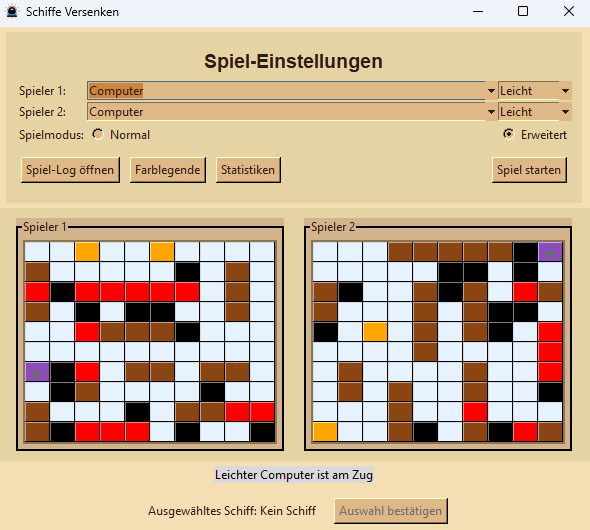
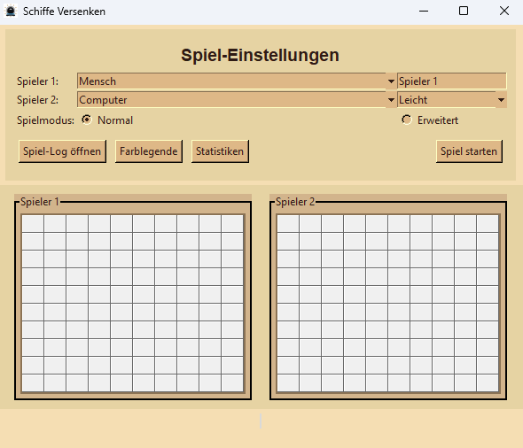
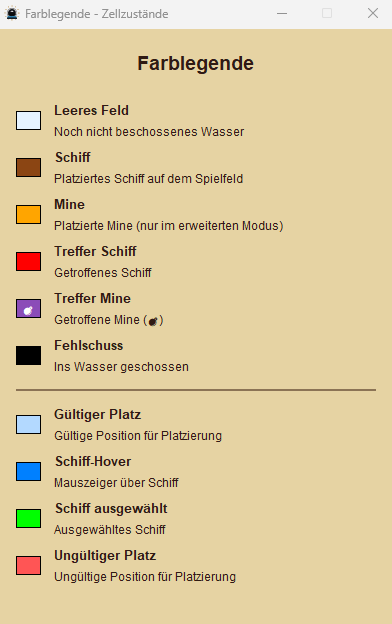
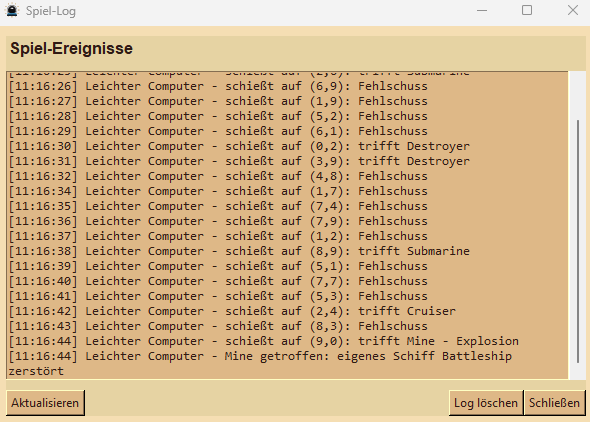
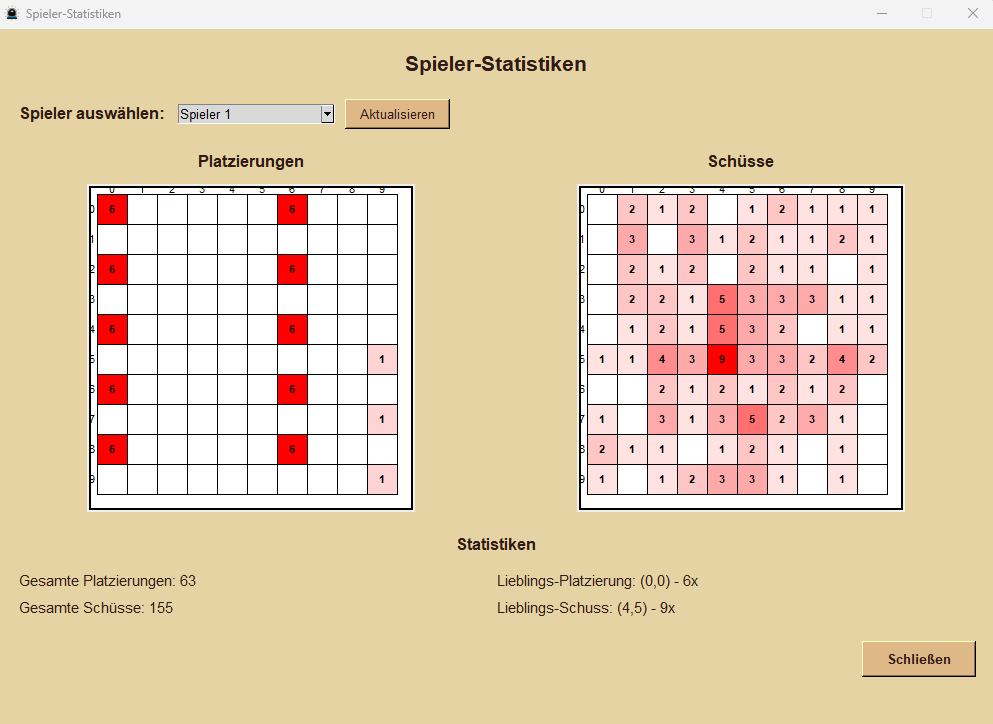

# Battleships - Schiffe Versenken



## Übersicht

Battleships ist eine moderne Python-Implementation des klassischen Brettspiels "Schiffe Versenken". Das Spiel bietet verschiedene Spielmodi, KI-Gegner unterschiedlicher Schwierigkeitsgrade und eine intuitive grafische Benutzeroberfläche.

## Funktionalitäten

### Spielmodi
- **Mensch vs. Computer**: Spiele gegen KI-Gegner verschiedener Schwierigkeitsgrade
- **Mensch vs. Mensch**: Lokaler Mehrspielermodus für zwei Spieler
- **Computer vs. Computer**: Beobachte KI-Kämpfe zwischen verschiedenen Schwierigkeitsgraden

### KI-Schwierigkeitsgrade
- **Einfach**: Zufällige Schüsse ohne Strategie
- **Mittel**: Grundlegende Jagdstrategie nach Treffern
- **Schwer**: Erweiterte Strategien und Mustererkennung
- **Unmöglich**: Perfekte Spielweise mit optimalen Entscheidungen

### Erweiterte Features
- **Minen**: Zusätzliche Spielelemente für mehr strategische Tiefe
- **Erweiterte Platzierungsphase**: Flexible Schiffs- und Minenplatzierung
- **Statistiken**: Detaillierte Spielstatistiken und Leistungsauswertung
- **Spielprotokoll**: Vollständige Aufzeichnung aller Spielzüge
- **Farblegenden**: Visuelle Hilfen zum Verständnis der Spielelemente



## Spielregeln

### Grundregeln
1. **Schiffe platzieren**: Jeder Spieler platziert seine Flotte auf dem eigenen Spielfeld
   - 1x Schlachtschiff (5 Felder)
   - 1x Kreuzer (4 Felder)  
   - 2x Zerstörer (3 Felder)
   - 2x U-Boot (2 Felder)

2. **Minen platzieren**: Optional können Minen auf dem Spielfeld platziert werden

3. **Schießen**: Spieler wechseln sich ab und versuchen, die gegnerischen Schiffe zu treffen
   - Treffer: Rotes Feld, weiterer Schuss möglich
   - Fehlschuss: Schwarzes Feld, Spielerwechsel
   - Schiff versenkt: Alle Felder des Schiffs werden markiert

4. **Sieg**: Gewonnen hat, wer alle gegnerischen Schiffe versenkt hat

### Erweiterte Regeln
- **Minen**: Explodieren bei Treffer und werden sofort zerstört
- **Erweiterte Schießphase**: Schiff kann ausgewählt werden, um mit diesem zu schießen (falls Schiff eine Mine trifft, wird Schiff zerstört)
- **Adjacency-Regel**: Schiffe dürfen sich nicht berühren (auch diagonal nicht)

## Screenshots

### Hauptspielansicht


### Farblegenden-Fenster


### Spielprotokoll


### Statistik-Fenster


## Code-Struktur

Das Projekt folgt einer klaren, objektorientierten Architektur mit Trennung der Verantwortlichkeiten:

### Hauptverzeichnisse

```
src/
├── Core/              # Spiellogik
│   ├── Board/         # Spielfeld und Zellen
│   ├── Entities/      # Spielobjekte (Schiffe, Minen)
│   └── GamePhases/    # Spielphasen-Management
├── Players/           # Spieler-Implementierungen
│   └── Computer/      # KI-Algorithmen
├── Utils/             # Hilfsfunktionen und Datenstrukturen
├── Views/             # UI und Darstellung
└── main.py            # Einstiegspunkt
```

### Architekturprinzipien

#### Game Layer (Spiellogik)
- **Board**: Verwaltung des Spielfelds und Platzierungsregeln
- **Entities**: Schiffe, Minen und andere Spielobjekte
- **GamePhases**: Phasenbasierte Spielsteuerung (Platzierung, Schießen, Ende)
- **Players**: Spieler-Implementierungen für Mensch und verschiedene KI-Level

#### View Layer (Benutzeroberfläche)
- **GameView**: Hauptfenster und Spielsteuerung
- **BoardView**: Darstellung der Spielfelder
- **UI-Manager**: Spezialisierte UI-Komponenten für verschiedene Phasen
- **Windows**: Zusatzfenster (Statistiken, Log, Einstellungen)

#### Utils Layer (Hilfsmittel)
- **Database**: Datenpersistierung für Statistiken
- **Logger**: Spielprotokollierung
- **Constants**: Spielkonfiguration und Konstanten

### Design Patterns

- **Strategy Pattern**: Verschiedene KI-Implementierungen
- **State Pattern**: Phasenbasierte Spielsteuerung
- **Observer Pattern**: UI-Updates bei Spielzustandsänderungen
- **Factory Pattern**: Erstellung von Spielern und Objekten

### Coding Standards

- **Clean Code**: Aussagekräftige Namen, kurze Methoden, klare Verantwortlichkeiten
- **Dokumentation**: Vollständige Docstrings für alle öffentlichen Methoden und Klassen
- **Typisierung**: Vollständige Type Hints für bessere Code-Qualität
- **Separation of Concerns**: Strikte Trennung von Logik und Darstellung

## Installation und Ausführung

### Voraussetzungen
- Python 3.8 oder höher
- tkinter (meist bereits mit Python installiert)

### Installation
1. Repository klonen oder herunterladen
2. In das Projektverzeichnis wechseln
3. Spiel starten:
   ```bash
   python src/main.py
   ```

### Entwicklung
Für die Entwicklung werden folgende Tools empfohlen:
- IDE mit Python-Support (PyCharm)
- Git für Versionskontrolle